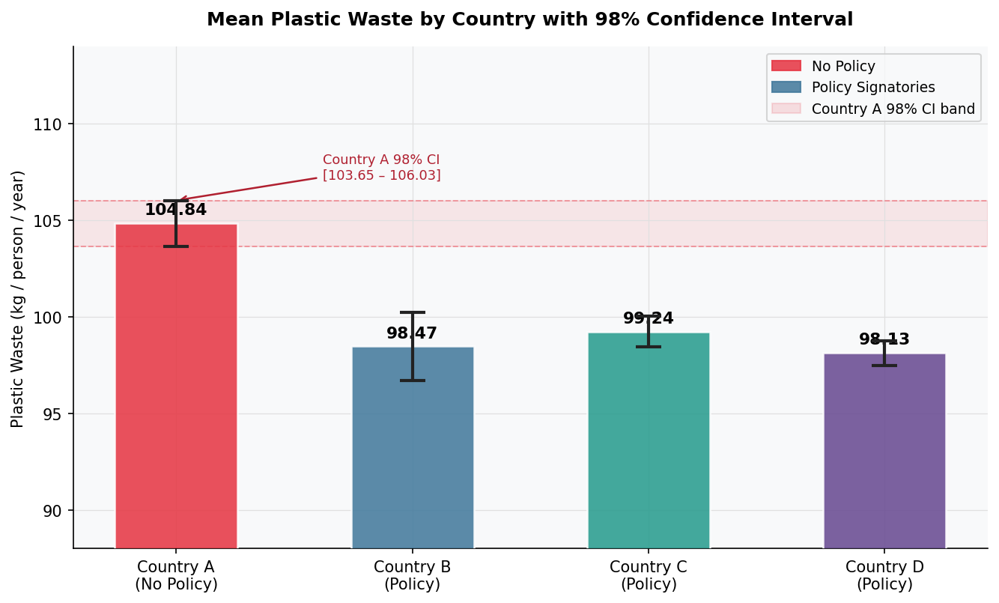
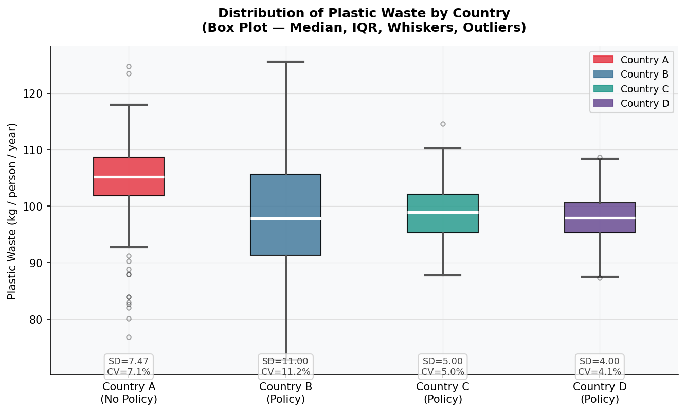

# Plastic Waste & Environmental Policy: A Cross-Country Statistical Analysis
### Quantifying the Impact of International Commitments on Sustainability Outcomes

**Context:** Case study prepared for UNEP environmental data analysis  
**Tools:** Python (matplotlib, scipy, numpy), Microsoft Excel  
**Data:** 848 survey respondents across 4 countries (~212 per country)  
**ESG Relevance:** Environmental policy effectiveness, sustainability benchmarking, cross-country disclosure comparison

---

## Overview

This study examines whether signing an international environmental commitment produces a statistically verifiable difference in plastic waste outcomes, a question central to ESG reporting and sustainable investing. Using UNEP survey data from four countries, one without a binding plastic waste commitment (Country A) and three with active commitments (B, C, D), the analysis applies rigorous statistical methods to assess policy effectiveness at the population level.

---

## Data

| Variable | Description |
|---|---|
| Plastic waste | Kilograms generated per person per year |
| Awareness participation | Environmental events attended in past 12 months |
| Country A | No signed commitment |
| Countries B, C, D | Signed and implemented commitment |

---

## Analytical Approach

| Step | Method | Purpose |
|---|---|---|
| 1 | Descriptive Statistics | Identify baseline patterns across countries |
| 2 | 98% Confidence Interval | Estimate true population mean for Country A |
| 3 | One-Way ANOVA | Test for significant cross-country variation |
| 4 | Z-Test (A vs B) | Isolate the direct policy effect |
| 5 | Correlation Analysis | Assess impact of awareness programs on waste |

---

## Key Findings

**1. Policy absence is associated with higher waste generation.**  
Country A averages 104.84 kg per person per year, meaningfully above the 98 to 99 kg range across B, C, and D. Negative skewness (-1.40) confirms this is a population-wide pattern, not driven by outliers.

| Country | Mean (kg/person) | Std Dev | Skewness |
|---|---|---|---|
| A (No Policy) | **104.84** | 7.47 | -1.399 |
| B (Policy) | 98.47 | 11.00 | -0.005 |
| C (Policy) | 99.24 | 5.00 | — |
| D (Policy) | 98.13 | 4.00 | — |



**2. The difference is statistically confirmed.**  
The 98% confidence interval for Country A is [103.64, 106.04] kg. All three policy countries fall below this range, ruling out sampling error as an explanation.



**3. ANOVA confirms cross-country variation is not random.**  
F = 38.587, p = 2.26e-23. Strong evidence that at least one country behaves differently, with Country A as the clear driver.

**4. Z-test confirms Country A generates significantly more waste than Country B.**  
z = 6.87, well above the threshold of 1.28. The policy gap between the two countries is a statistically significant contributor to this difference.

**5. Awareness programs produce a measurable reduction in waste.**

| Country | Correlation (r) |
|---|---|
| A | -0.2203 |
| B | -0.6527 |
| C | -0.3883 |
| D | -0.3832 |

All four countries show a negative relationship between event attendance and waste generation. In Country A, the result is statistically significant at α = 0.01 (t = -3.27), confirming that behavioral programs reduce waste even without a binding policy framework.


---

## Conclusions

Binding environmental commitments are associated with meaningfully lower plastic waste at the population level. Awareness programs deliver statistically significant reductions even in their absence. Both findings are directly relevant to how ESG frameworks evaluate environmental policy effectiveness and the measurable impact of sustainability initiatives.

---

## Policy Recommendations

1. Encourage Country A to join the international agreement, supported by this study's quantitative evidence.
2. Scale awareness programs across all countries given their consistent and significant effect on behavior.
3. Set country-specific reduction targets based on baseline means and variance to enable meaningful ESG-aligned progress tracking.

---

## Repository Structure

```
plastic-waste-analysis/
    README.md
    data/
        139663_Vu.xls
    report/
        139663_Vu.xls.pdf
    images/
        chart1_mean_ci.png
        chart2_boxplot.png
        chart3_correlation.png
```

---

## References

Statista - Global Plastic Waste Overview: https://www.statista.com/topics/5401/global-plastic-waste/  
United Nations Environment Programme (UNEP) - Plastic Waste Policy Framework
